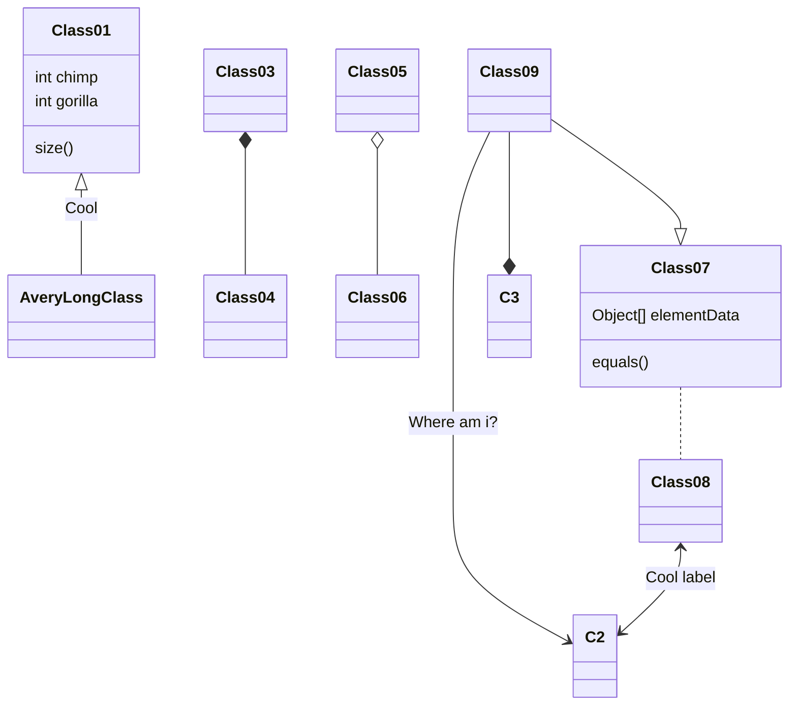

# 组件级别控制流
## 目标
* 应该是一个调用控制层，并提供一定的api能力
* 可以调用各种前端UI库，需要对应的UI库实现接口
* 先基于Vue.JS实现

```mermaid
classDiagram
Class01 <|-- AveryLongClass : Cool
Class03 *-- Class04
Class05 o-- Class06
Class07 .. Class08
Class09 --> C2 : Where am i?
Class09 --* C3
Class09 --|> Class07
Class07 : equals()
Class07 : Object[] elementData
Class01 : size()
Class01 : int chimp
Class01 : int gorilla
Class08 <--> C2: Cool label
```